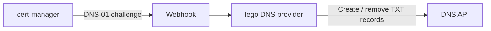

# cert-manager-lego-webhook

**Use lego DNS providers with cert-manager.**

[](https://github.com/yxwuxuanl/cert-manager-lego-webhook/actions/workflows/build.yml)
[](https://github.com/yxwuxuanl/cert-manager-lego-webhook/actions/workflows/helm.yml)
[](https://github.com/yxwuxuanl/cert-manager-lego-webhook/releases/latest)

A DNS-01 solver webhook that connects [cert-manager](https://cert-manager.io/) to
[lego](https://github.com/go-acme/lego)'s DNS providers. cert-manager handles
certificate issuance and renewal; this webhook creates and removes the DNS
challenge records through your provider's API.

[Quick start](#quick-start) · [Configuration](docs/configuration.md) · [Troubleshooting](docs/troubleshooting.md) · [Releases](https://github.com/yxwuxuanl/cert-manager-lego-webhook/releases) · [Contributing](CONTRIBUTING.md)

## Why use it?

- **One installation, multiple providers.** Select a lego provider in each
  `Issuer` or `ClusterIssuer` solver configuration.
- **Credentials from Kubernetes Secrets.** Use the environment variable names
  documented by your lego provider.
- **Helm deployment.** The chart includes the webhook, API registration, RBAC,
  and serving certificates. Image builds target Linux AMD64 and ARM64.



Browse the [lego provider directory](https://go-acme.github.io/lego/dns/) for
provider codes and credentials. Available providers depend on the lego version
bundled with your webhook release; see [provider support](docs/configuration.md#provider-support).

## Quick start

### 1. Install the webhook

You need a Kubernetes cluster with [cert-manager installed](https://cert-manager.io/docs/installation/),
Helm, kubectl, and a DNS zone you can manage through a supported provider.
Installing the chart requires permission to create cluster-scoped resources.

The commands below install the webhook in `cert-manager` and assume cert-manager
uses that namespace and the `cert-manager` ServiceAccount. Adjust the namespace
and `certManager.serviceAccountName` for your installation.

```sh
helm repo add cert-manager-lego-webhook https://yxwuxuanl.github.io/cert-manager-lego-webhook/
helm repo update

helm upgrade --install cert-manager-lego-webhook \
  cert-manager-lego-webhook/cert-manager-lego-webhook \
  --version 1.6.0 \
  --namespace cert-manager \
  --create-namespace \
  --set certManager.namespace=cert-manager \
  --set certManager.serviceAccountName=cert-manager \
  --wait --timeout 5m
```

These commands install chart **1.6.0** with webhook image **v1.6.0**. To select
another release, change `--version`. See the
[Helm options](docs/configuration.md#helm-values) for image, scheduling, and DNS settings.

### 2. Configure your DNS provider

The [Alibaba Cloud DNS example](examples/alidns/) includes a Secret,
ClusterIssuer, and Certificate. Download this repository or clone it to use the
example files locally:

```sh
git clone https://github.com/yxwuxuanl/cert-manager-lego-webhook.git
cd cert-manager-lego-webhook
```

Before applying them:

- Fill in your [Alibaba Cloud DNS credentials](https://go-acme.github.io/lego/dns/alidns/#credentials)
  in `examples/alidns/secret.yaml`. Keep the completed file private.
- Set your ACME contact email in `examples/alidns/clusterissuer.yaml`.
- Replace both example DNS names in `examples/alidns/certificate.yaml` with
  names in your DNS zone.

The example explicitly reads `alidns-secret` from `cert-manager` and creates the
Certificate in `default`. Change these namespaces if needed. Its solver uses:

```yaml
dns01:
  webhook:
    groupName: lego.dns-solver
    solverName: lego-solver
    config:
      provider: alidns
      envFrom:
        secret:
          name: alidns-secret
          namespace: cert-manager
```

When using `envFrom.secret`, omit `envs` entirely. Even `envs: {}` takes
precedence and prevents the webhook from reading the Secret.

### 3. Issue and verify a certificate

The example uses [Let's Encrypt staging](https://letsencrypt.org/docs/staging-environment/)
to verify the setup. Staging certificates are not trusted by browsers.

```sh
kubectl apply -f examples/alidns/secret.yaml
kubectl apply -f examples/alidns/clusterissuer.yaml
kubectl wait --for=condition=Ready clusterissuer/alidns-staging --timeout=2m

kubectl apply -f examples/alidns/certificate.yaml
kubectl wait --for=condition=Ready certificate/lego-example \
  --namespace default --timeout=5m
kubectl get secret lego-example-tls --namespace default
```

If issuance does not complete, inspect the Certificate and Challenge events
using the [troubleshooting guide](docs/troubleshooting.md).

For a trusted certificate, create a separate production ClusterIssuer using
`https://acme-v02.api.letsencrypt.org/directory`, a new issuer name, and a new
`privateKeySecretRef.name`. Update your Certificate's `issuerRef.name` to use it.

## Documentation

| Guide | Contents |
| --- | --- |
| [Configuration](docs/configuration.md) | Provider support, Secret namespaces, environment settings, Helm values |
| [Alibaba Cloud DNS example](examples/alidns/) | Manifests for a staging certificate, including a wildcard name |
| [Troubleshooting](docs/troubleshooting.md) | Installation, credentials, DNS propagation, and certificate events |
| [Contributing](CONTRIBUTING.md) | Local development, checks, and pull requests |

Found a problem? [Open an issue](https://github.com/yxwuxuanl/cert-manager-lego-webhook/issues)
with your chart version, provider code, and redacted configuration and error output.
